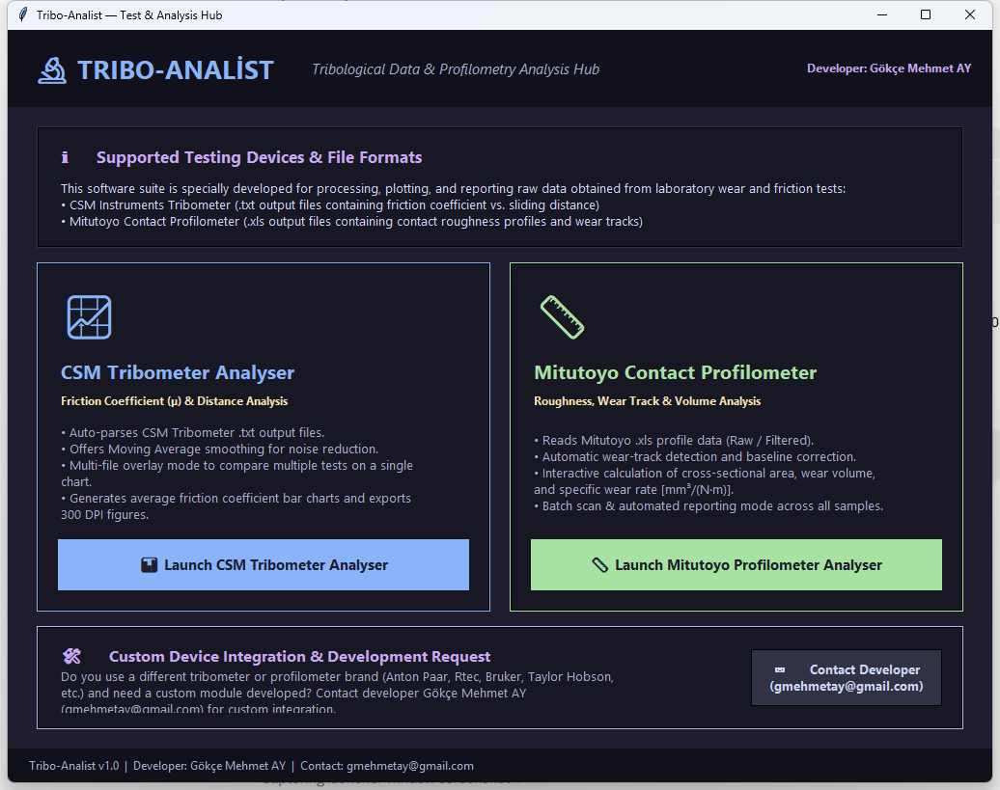
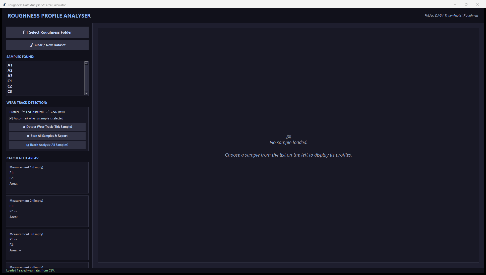
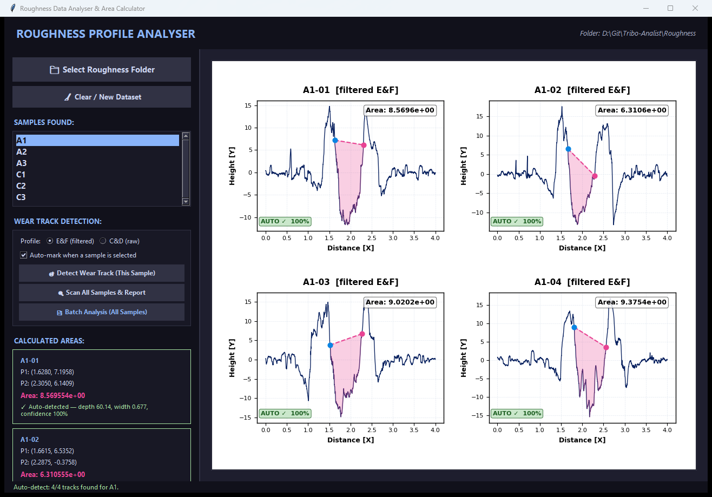
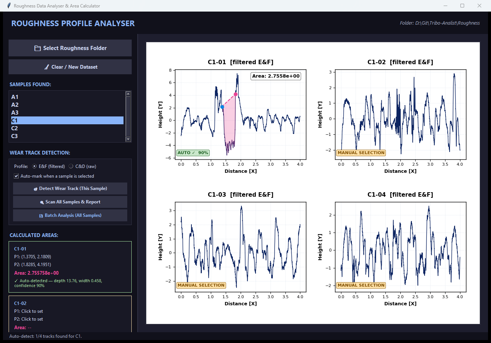
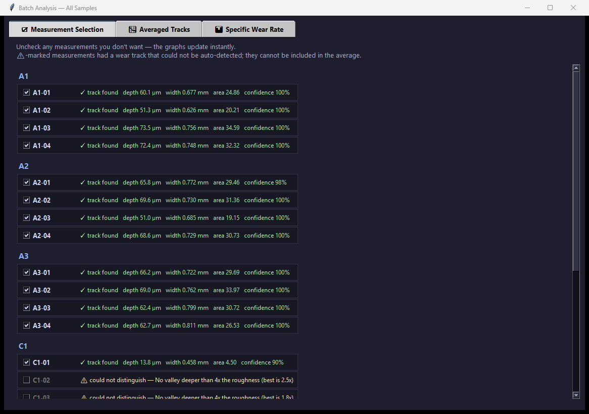
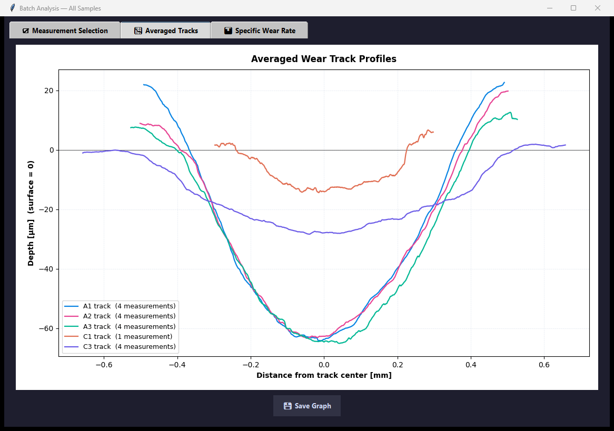
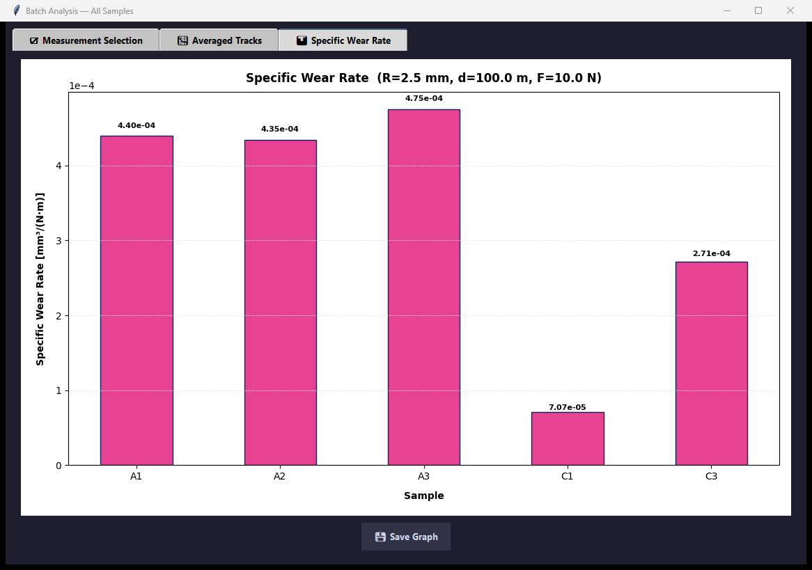
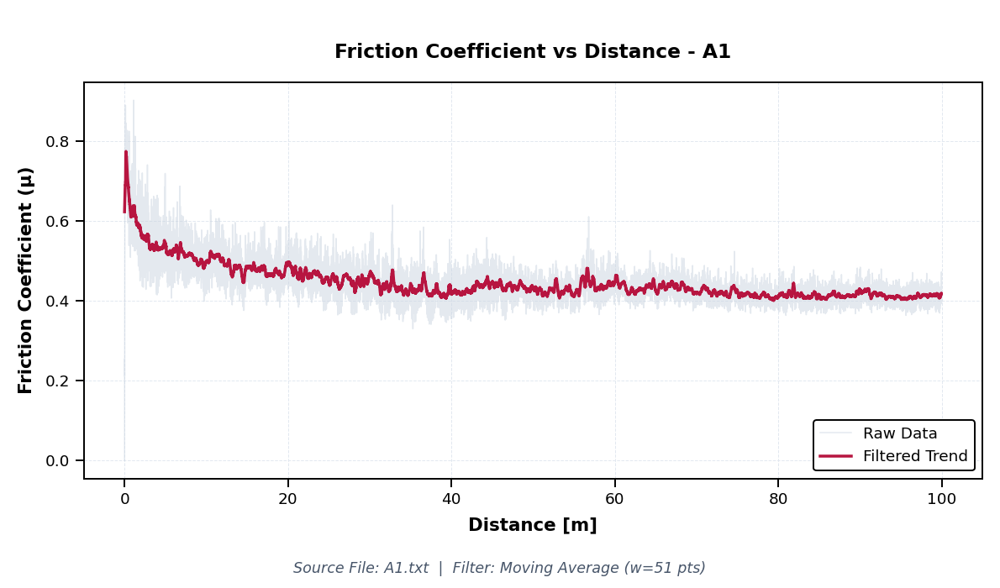
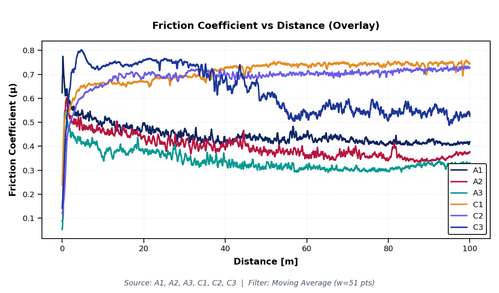
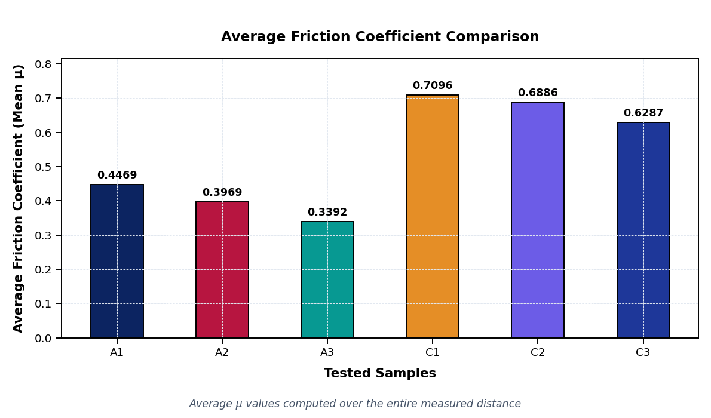

# Tribo-Analist — Usage Guide

A walkthrough of both tools with screenshots. For installation and file-format requirements, see [README.md](README.md).

## Demo video

<video src="docs/tribo_analist_usage_slideshow.mp4" controls width="720">
  Your browser (or GitHub's renderer) can't play this inline —
  <a href="docs/tribo_analist_usage_slideshow.mp4">download the video directly</a>.
</video>

*(44s slideshow of the screenshots below, with captions. Click to play.)*

## Contents

- [Demo video](#demo-video)
- [1. Launcher](#1-launcher)
- [2. Mitutoyo Profilometer Analyser (`roughness_analyser.py`)](#2-mitutoyo-profilometer-analyser-roughness_analyserpy)
  - [2.1 Loading a data folder](#21-loading-a-data-folder)
  - [2.2 Automatic wear-track detection](#22-automatic-wear-track-detection)
  - [2.3 When the track can't be found automatically](#23-when-the-track-cant-be-found-automatically)
  - [2.4 Manual point selection](#24-manual-point-selection)
  - [2.5 Wear-rate calculation](#25-wear-rate-calculation)
  - [2.6 Batch analysis across a whole sample set](#26-batch-analysis-across-a-whole-sample-set)
- [3. CSM Tribometer Analyser (`tribo_plotter.py`)](#3-csm-tribometer-analyser-tribo_plotterpy)
  - [3.1 Single friction curve](#31-single-friction-curve)
  - [3.2 Overlay mode](#32-overlay-mode)
  - [3.3 Average µ comparison](#33-average-µ-comparison)

---

## 1. Launcher

Running `python main.py` (or the standalone `Tribo-Analist.exe` on Windows) opens a hub window where you pick which tool to use:

- **Launch CSM Tribometer Analyser** opens the friction-curve tool ([section 3](#3-csm-tribometer-analyser-tribo_plotterpy)).
- **Launch Mitutoyo Profilometer Analyser** opens the wear-track tool ([section 2](#2-mitutoyo-profilometer-analyser-roughness_analyserpy)).

Both tools can also be run directly — `python roughness_analyser.py` or `python tribo_plotter.py` — without going through the launcher.

---

## 2. Mitutoyo Profilometer Analyser (`roughness_analyser.py`)

### 2.1 Loading a data folder

On startup the app looks for a `Roughness/` folder next to the script; use **Select Roughness Folder** to point it elsewhere. `.xls` files are grouped into samples by the part of the filename before the `-` (so `A1-01.xls`, `A1-02.xls`, `A1-03.xls`, `A1-04.xls` all belong to sample **A1**). Pick a sample from the list to load its measurements:

- **Profile: E&F (filtered) / C&D (raw)** — which pair of columns is plotted and measured. `E&F` (filtered) is the default and matches the instrument's own roughness-filtered output. `C&D` (raw) shows the profile before filtering, where the wear track keeps its true depth (the roughness filter tends to flatten it by 2–4×). Detection always runs on the raw trace internally regardless of this setting, so the choice mainly affects what you see and what area gets measured.
- **Auto-mark when a sample is selected** — runs detection automatically every time you pick a sample (on by default).

### 2.2 Automatic wear-track detection

Selecting a sample loads all of its measurements (up to 4, shown in a 2×2 grid) and automatically finds the wear track in each one:

For each measurement that was successfully detected:
- A green **AUTO ✓ 100%** badge appears in the corner of its plot, where the percentage is a confidence score.
- The two boundary points (P1/P2), the connecting chord, and the shaded cross-sectional area are drawn automatically.
- The sidebar's **Calculated Areas** panel lists the coordinates and area for each measurement.

The detector works by fitting the un-worn surface trend and flagging valleys that are both much deeper and much wider than the background surface roughness — so it distinguishes an actual wear scar from ordinary roughness noise.

### 2.3 When the track can't be found automatically

Some measurements genuinely have no distinguishable wear track (too shallow, too narrow, or masked by roughness of similar depth). These are left for you to check by eye and, if needed, select manually:

- An amber **MANUAL SELECTION** badge marks each one.
- The sidebar shows the reason detection gave up, e.g. *"No valley deeper than 4x the roughness"* or *"Valley too narrow — looks like roughness, not a wear track."*
- The status bar at the bottom summarizes the result, e.g. *"Auto-detect: 1/4 tracks found for C1."*

Always sanity-check the automatically detected tracks against the raw profile before relying on the results — the algorithm is a heuristic, not a certainty.

### 2.4 Manual point selection

For any measurement — whether flagged for manual selection or not — you can override the automatic selection by clicking directly on its plot:

1. **First click** sets point P1 (snaps to the nearest data point).
2. **Second click** sets point P2, draws the chord between P1 and P2, shades the enclosed area, and computes it.
3. **Third click** clears the selection so you can start over.

You can also use the sidebar buttons:
- **Detect Wear Track (This Sample)** — re-runs automatic detection for the currently loaded sample and reports how many measurements were found.
- **Scan All Samples & Report** — runs detection across the entire folder and opens a report window listing every measurement's result, with an option to save it as a text file.

### 2.5 Wear-rate calculation

Enter the counter-ball **Radius**, sliding **Distance**, and applied **Load** in the sidebar, then click **Calculate Specific Wear Rate**. The tool averages the areas from all measured points in the current sample and computes the wear volume (mm³) and specific wear rate (mm³/(N·m), Archard-type), saving both to `wear_rates_summary.csv` in the data folder.

**Specific Wear Rate Graph** opens a bar chart comparing the specific wear rate across every sample calculated so far, with a save button underneath.

### 2.6 Batch analysis across a whole sample set

**Batch Analysis (All Samples)** processes every sample in the folder at once and opens a three-tab window.

**Measurement Selection** — every measurement, grouped by sample, with its detection result. Auto-detected measurements are pre-checked; measurements flagged for manual selection are unchecked and disabled (since they have no valid area to include). Unchecking any measurement updates the other two tabs instantly:

**Averaged Tracks** — for each sample, the selected measurements' wear-track profiles are baseline-corrected (surface = 0), centered on the track, and averaged into a single curve, all shown together for comparison:

**Specific Wear Rate** — a bar chart of the specific wear rate per sample, computed from the average area of the checked measurements using the radius/distance/load values from the sidebar:

Each graph tab has its own **Save Graph** button (300 DPI PNG, saved to the `graphs/` folder next to your data).

---

## 3. CSM Tribometer Analyser (`tribo_plotter.py`)

Select a folder of `.txt` tribometer output files, check the ones you want, and click **Plot Selected**.

### 3.1 Single friction curve

With one file checked and overlay mode off, the friction coefficient (µ) is plotted against sliding distance, with the raw signal in the background and a moving-average trend line on top:

Use **◀ Previous** / **Next ▶** to step through multiple checked files one at a time. The moving-average window size is adjustable from the sidebar.

### 3.2 Overlay mode

Check **Overlay Mode** to plot several files on the same axes for direct comparison instead of paging through them individually:

### 3.3 Average µ comparison

The **Average µ Comparison** tab shows a bar chart of the mean friction coefficient per file, computed over the full measured distance:

Both tools' plots can be saved with **Save Selected Plots** / the graph tab's save button, as 300 DPI PNGs.
